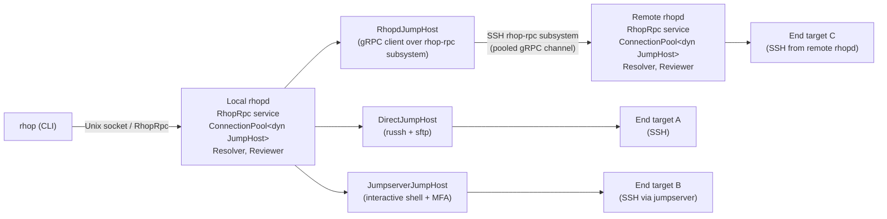
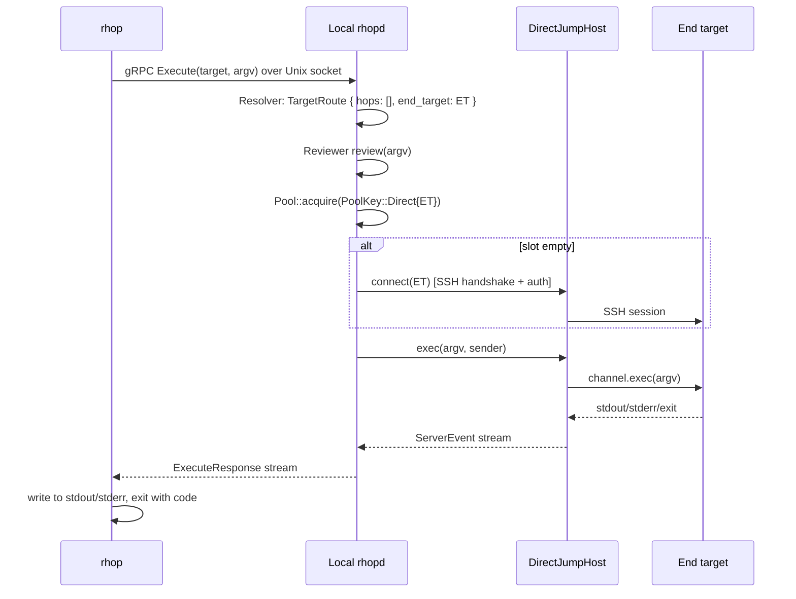
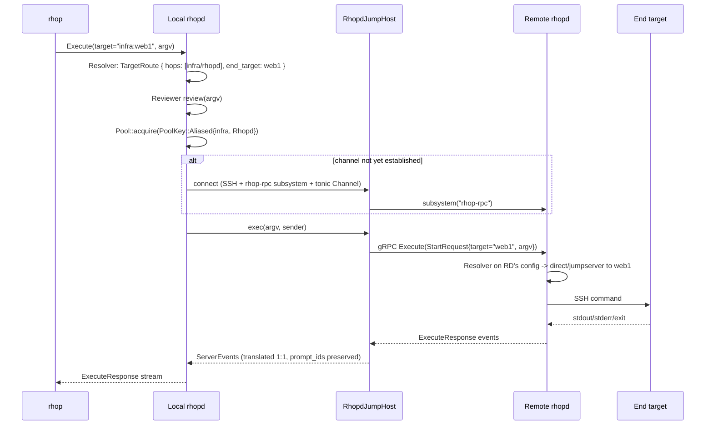
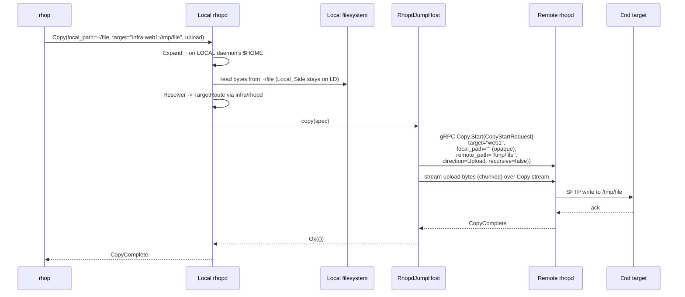
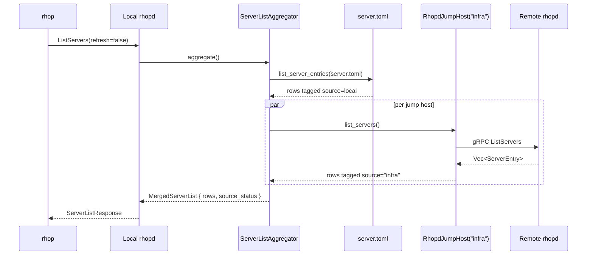
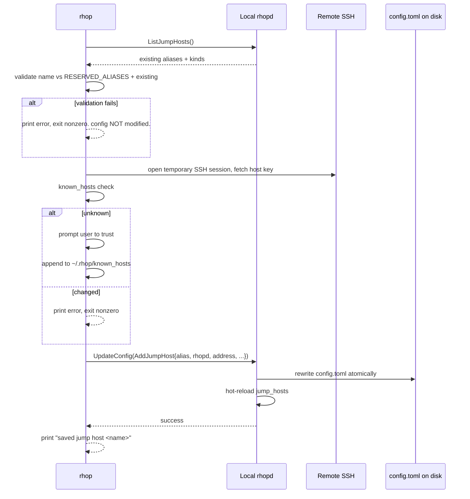

# Design Document

## Overview

This refactor collapses the current dual-CLI-mode architecture (`local` vs `remote`) into a single uniform pipeline:

```
rhop (CLI)  ──Unix socket──▶  Local rhopd  ──Vec<JumpHop>──▶  End target
```

Every CLI subcommand goes through the local `rhopd`. Reaching an end target is always expressed as a `Vec<JumpHopRef>` (zero or more jump hops) followed by an `EndTarget`. `direct` SSH, the interactive `jumpserver` shell, and a `rhopd` running on another machine are interchangeable implementations of one trait, `JumpHost`.

The most user-visible consequences of unifying on this model:

- `rhop cp ~/local/file remote:/path` always reads `~/local/file` from the user's own filesystem (the local daemon's filesystem). The bug where the remote daemon tried to `stat` the user's local path goes away by construction.
- Connection reuse becomes uniform. The local daemon's pool stores `Box<dyn JumpHost>` keyed by jump-host alias (or `(direct, end_target)` for direct routes), with the same per-key concurrency cap and idle reaper applied across all kinds, including pooled gRPC channels to remote `rhopd`s.
- Adding a new way to reach hosts is a single trait impl plus a `JumpHostKind` enum variant plus a factory case. CLI handlers, the pool, and the gRPC service do not change.

Because the user has explicitly opted out of backward compatibility, this design freely deletes the `ClientMode` enum, the `[remote]` block in `client.toml`, the SSH client code path inside `rhop`, and the `rhop remote enable/disable` subcommands. The `client.toml` and `config.toml` schemas are rewritten in place.

### Scope

In scope:
- New `JumpHost` trait with `exec`, `copy`, `tui_shell`, `list_servers`.
- Concrete impls: `DirectJumpHost`, `JumpserverJumpHost`, `RhopdJumpHost`.
- Pool refactor keyed by jump-host alias (and `(direct, end_target)` for direct).
- Resolver producing `Vec<TargetRoute>` candidates from `Vec<JumpHopRef> + EndTarget`.
- `client.toml` and `config.toml` schema rewrite.
- New `rhop remote connect/remove/list` semantics.
- Merged `rhop server list` aggregation with disambiguation rules.
- Auth-prompt forwarding through any number of hops.
- Status RPC that surfaces sub-pool state across `rhopd` jump hosts.

Out of scope:
- The interactive TUI shell over `rhopd` (the trait method exists; the implementation returns `UnsupportedCapability`).
- Migration tooling for old config files (user has opted out of compat).
- Changes to the `review` subsystem's review semantics (only its placement on the path is constrained).

## Architecture

### High-level component diagram



Key facts encoded in the diagram:

1. The CLI has exactly one outbound edge: to the local daemon over a Unix socket. There is no SSH path out of the CLI.
2. Both daemons (local and remote) run the same `RhopRpc` service. The only difference is transport: local listens on a Unix socket, remote listens on TCP and accepts the `rhop-rpc` SSH subsystem.
3. `RhopdJumpHost` is the local daemon's gRPC client wrapper around a remote `RhopRpc` service. It implements all four `JumpHost` trait methods by translating each into the corresponding RPC.
4. Both daemons own their own `ConnectionPool`. Pool reuse happens at every layer: local daemon → jump hosts, and remote daemon → its own end targets.

### Request flow taxonomy

For `rhop exec <target> <argv>`:

- If the resolver picks a `Direct` hop: the local daemon opens (or reuses) a `DirectJumpHost` connection to the end target's SSH daemon and runs the command.
- If the resolver picks a `Jumpserver` hop: the local daemon opens (or reuses) a `JumpserverJumpHost` shell, navigates the menu/MFA, runs the command on the selected end target.
- If the resolver picks a `Rhopd` hop: the local daemon reuses (or opens) a `RhopdJumpHost` gRPC channel to the remote daemon, calls `Execute` against the remote daemon with `<target> <argv>`. The remote daemon runs its own resolver against its own `server.toml` / `config.toml` and forwards the request to its end-target jump host.

For `rhop cp <src> <dst>`:

- Local-side filesystem I/O is always done by the local daemon.
- For direct/jumpserver hops, the existing SFTP / heredoc-stream code path is preserved, just behind the trait.
- For a `Rhopd` hop, the local daemon streams bytes over the gRPC `Copy` RPC: it sends `CopyStartRequest { local_path is meaningless to the remote, remote_path = end-target path, direction, recursive }` and the local-side reads/writes happen on its own filesystem; the remote daemon performs only the end-target side of the copy.

For `rhop server list`:

- The local daemon enumerates its own `server.toml` (source alias `local`) plus invokes `JumpHost::list_servers` on every configured jump host whose kind supports it.
- For `Rhopd` jump hosts, that maps to the remote daemon's `ListServers` RPC.
- The merged response tags every row with its `Server_List_Source`.

### Why a single trait

The current code base has two parallel decision points: `ClientMode` in the CLI and `TargetTransport` in the resolver. Each new way to reach hosts requires changes in both places, plus in the pool, the daemon main loop, and the gRPC service. By collapsing them into one trait whose dispatch happens entirely inside the daemon and whose implementation set is the only place that "knows" about specific kinds, we satisfy Requirement 16 (trait extensibility discipline) as a structural property rather than a convention.

## Components and Interfaces

This section gives Rust signatures for the major types. Every signature is the actual type the implementation should adopt; if a tradeoff was made, the rationale is noted inline.

### `JumpHost` trait

```rust
// src/jump/mod.rs

use anyhow::Result;
use async_trait::async_trait; // alias of tonic::async_trait if desired
use tokio::sync::mpsc::UnboundedSender;

use crate::config::AppConfig;
use crate::connection::CopySpec;
use crate::protocol::{ServerEvent, ServerEntry};

#[async_trait]
pub trait JumpHost: Send {
    /// Required. Run a command on the end target reachable through this hop.
    async fn exec(
        &mut self,
        argv: &[String],
        sender: &UnboundedSender<ServerEvent>,
        config: &AppConfig,
    ) -> Result<i32>;

    /// Required. Carry out the remote-side half of a copy. The local-side I/O
    /// is the responsibility of whoever called this method (the local daemon).
    async fn copy(&mut self, spec: &CopySpec, config: &AppConfig) -> Result<()>;

    /// Optional. Open a fully interactive PTY shell session to the end target.
    /// Default returns an `UnsupportedCapability` error.
    async fn tui_shell(&mut self, _config: &AppConfig) -> Result<()> {
        Err(UnsupportedCapability {
            kind: self.kind(),
            alias: self.alias().to_string(),
            method: "tui_shell",
        }
        .into())
    }

    /// Optional. Enumerate the end-target catalog reachable through this hop.
    /// Default returns an `UnsupportedCapability` error.
    async fn list_servers(&mut self, _config: &AppConfig) -> Result<Vec<ServerEntry>> {
        Err(UnsupportedCapability {
            kind: self.kind(),
            alias: self.alias().to_string(),
            method: "list_servers",
        }
        .into())
    }

    /// Identity for pool keying and diagnostics.
    fn kind(&self) -> JumpHostKind;
    fn alias(&self) -> &str;
}
```

Notes:

- `exec` and `copy` have **no default** to enforce that every concrete kind implements them (Requirement 3.2).
- `tui_shell` and `list_servers` have defaults that return `UnsupportedCapability` so a new kind compiles without writing them (Requirement 3.3, 16.3).
- `kind()` and `alias()` exist so the pool, status output, and aggregator can identify a hop without downcasting.
- The trait is `Send` but not `Sync`. A `Box<dyn JumpHost>` lives behind a `tokio::sync::Mutex` inside the pool slot, exactly as today.
- `CopySpec` is unchanged in shape; what changes is that for `RhopdJumpHost::copy`, the implementation interprets `local_path` as opaque — only the `remote_path` and `direction` cross the gRPC boundary. See `RhopdJumpHost::copy` below.

### `UnsupportedCapability` error

```rust
// src/jump/error.rs

#[derive(Debug, thiserror::Error)]
#[error("jump host {alias} (kind={kind}) does not support method {method}")]
pub struct UnsupportedCapability {
    pub kind: JumpHostKind,
    pub alias: String,
    pub method: &'static str,
}
```

This is a typed error rather than a string so callers can match on it. Specifically, the merged server-list aggregator must distinguish "this jump host opted out of `list_servers`" from "this jump host failed transport-level". `anyhow::Error::downcast_ref::<UnsupportedCapability>()` is the test.

### Concrete `JumpHost` implementations

#### `DirectJumpHost`

```rust
// src/jump/direct.rs

pub struct DirectJumpHost {
    alias: String,             // Reserved::DIRECT or a configured alias if we ever name direct routes.
    inner: DirectSshConnection // existing struct in src/connection/direct.rs
}

#[async_trait]
impl JumpHost for DirectJumpHost {
    async fn exec(...) -> Result<i32> { self.inner.execute(argv, sender, config).await }
    async fn copy(&mut self, spec: &CopySpec, config: &AppConfig) -> Result<()> {
        self.inner.copy(spec, config).await
    }
    fn kind(&self) -> JumpHostKind { JumpHostKind::Direct }
    fn alias(&self) -> &str { &self.alias }
    // tui_shell, list_servers fall through to default UnsupportedCapability.
}
```

`DirectJumpHost` is essentially the current `DirectSshConnection` wearing the trait. The implementation file moves under `src/jump/direct.rs`, but the SFTP/SSH machinery is unchanged.

#### `JumpserverJumpHost`

```rust
// src/jump/jumpserver.rs

pub struct JumpserverJumpHost {
    alias: String,
    inner: JumpSshConnection,  // existing struct in src/connection/jump.rs
}
```

Same story: wear the trait, keep the existing shell-pumping/MFA/heredoc logic. `tui_shell` and `list_servers` fall through to default for now.

#### `RhopdJumpHost`

This is the only genuinely new implementation.

```rust
// src/jump/rhopd.rs

pub struct RhopdJumpHost {
    alias: String,
    address: RemoteAddress,                 // see Data Models
    transport: RhopdTransport,              // SSH connection + multiplexed gRPC channel
    client: rpc::rhop_rpc_client::RhopRpcClient<tonic::transport::Channel>,
}

struct RhopdTransport {
    ssh_handle: russh::client::Handle<RemoteClientHandler>,
    // The gRPC `Channel` lives inside `client`. The SSH handle is kept alive for
    // the lifetime of the channel; dropping it tears down the rhop-rpc subsystem.
    ssh_channel: russh::Channel<russh::client::Msg>,
}

#[async_trait]
impl JumpHost for RhopdJumpHost {
    async fn exec(
        &mut self,
        argv: &[String],
        sender: &UnboundedSender<ServerEvent>,
        config: &AppConfig,
    ) -> Result<i32> {
        // Translate to RhopRpc.Execute on the remote daemon.
        // - send StartRequest { target: end_target_alias, argv }
        // - bridge ExecuteResponse events back to `sender`
        // - bridge AuthPrompt events through the local daemon's prompter (see AuthPromptRouter)
        // - on transport-level error, return Err(_) so the pool retries on a fresh channel.
        rhopd_execute(&mut self.client, ...).await
    }

    async fn copy(&mut self, spec: &CopySpec, _config: &AppConfig) -> Result<()> {
        // Translate to RhopRpc.Copy on the remote daemon, but with a critical
        // detail: the local-side I/O is NOT delegated. The local daemon opens
        // local files itself; only the remote-side bytes flow over gRPC.
        //
        // - send CopyStartRequest { target: end_target_alias, remote_path, recursive, direction }
        //   (local_path is set to "" because the remote daemon must not touch it)
        // - bridge AuthPrompts upstream
        // - for Upload: read local bytes locally, push to gRPC stream
        // - for Download: receive bytes from gRPC stream, write locally
        rhopd_copy(&mut self.client, spec).await
    }

    async fn tui_shell(&mut self, _config: &AppConfig) -> Result<()> {
        // Until interactive shell ships, return UnsupportedCapability per Req 4.5.
        Err(UnsupportedCapability {
            kind: JumpHostKind::Rhopd,
            alias: self.alias.clone(),
            method: "tui_shell",
        }.into())
    }

    async fn list_servers(&mut self, _config: &AppConfig) -> Result<Vec<ServerEntry>> {
        // Translate to RhopRpc.ListServers on the remote daemon.
        let response = self.client.list_servers(rpc::ServerListRequest {}).await?;
        Ok(decode_server_list(response.into_inner()))
    }

    fn kind(&self) -> JumpHostKind { JumpHostKind::Rhopd }
    fn alias(&self) -> &str { &self.alias }
}
```

Key design choices:

- **One gRPC channel per `rhopd` alias**: the channel multiplexes Execute/Copy/Status/ListServers. Tonic supports concurrent RPCs on a single channel; this is how the per-jump-host concurrency cap (`ssh.max_connections_per_ip`) is meaningful for `rhopd` — it caps in-flight RPCs on the channel, not separate SSH sessions.
- **CopyStartRequest's `local_path` is intentionally empty for `rhopd` hops**. The remote daemon must reject any `local_path` that is non-empty when the request originated through `rhop-rpc` (it has no business touching paths it does not own). See `Error Handling`.
- **Transport-level errors evict the channel**. The pool wraps the call in the `should_reconnect` style retry that `pool.rs` already has, but the trigger is now any `tonic::Status::Code` in the `Unavailable | Cancelled | Unknown | Internal` set or any I/O-shaped error string. On retry, a fresh `RhopdJumpHost` is built (new SSH handle + new gRPC channel) and the request is re-attempted exactly once (Requirement 4.9).

#### `JumpHost` factory

```rust
// src/jump/factory.rs

pub fn build_jump_host(
    spec: &JumpHostConfig,           // see Data Models
    auth_prompter: &Arc<AuthPrompter>,
    config: &AppConfig,
) -> Result<Box<dyn JumpHost>> {
    match spec.kind {
        JumpHostKind::Direct => Ok(Box::new(DirectJumpHost::connect(...).await?)),
        JumpHostKind::Jumpserver => Ok(Box::new(JumpserverJumpHost::connect(...).await?)),
        JumpHostKind::Rhopd => Ok(Box::new(RhopdJumpHost::connect(...).await?)),
    }
}
```

This is the *only* place the resolver/pool needs to learn about a new kind. Adding a future `Tailscale` jump host means: add the variant, add the factory arm, write the impl. CLI handlers, the pool, the gRPC service do not change (Requirement 16.1, 16.2).

### `ConnectionPool` refactor

```rust
// src/pool.rs

pub struct ConnectionPool {
    config: Arc<RwLock<AppConfig>>,
    pools: Arc<Mutex<HashMap<PoolKey, Arc<TargetPool>>>>,
}

#[derive(Clone, Debug, Eq, Hash, PartialEq)]
pub enum PoolKey {
    /// Direct routes have no jump-host alias; key by end-target so two direct
    /// SSH connections to the same end target share a slot, but different end
    /// targets do not.
    Direct { end_target: EndTargetId },
    /// Every other kind is keyed solely by jump-host alias. The same alias
    /// always shares a slot; the pool transparently multiplexes requests for
    /// different end targets on it.
    Aliased { alias: String, kind: JumpHostKind },
}
```

What changes vs current `pool.rs`:

- The key is `PoolKey`, not `String`, but the slot machinery (notify, idle reaper, per-key cap = `ssh.max_connections_per_ip`) is preserved.
- Slots store `Arc<PooledJumpHost>` where `PooledJumpHost` wraps `tokio::sync::Mutex<Option<Box<dyn JumpHost>>>` — same shape as today's `PooledConnection`.
- `execute` / `copy` accept a `TargetRoute` instead of `Vec<ResolvedTarget>`. Routes encode `(Vec<JumpHopRef>, EndTarget)`. The pool selects/creates the `JumpHost` for the *first* hop in the route (zero hops = direct to end target). For now, all real routes have exactly one hop or zero; nested routes (jumpserver-through-rhopd, etc.) are out of scope but the type allows expressing them later.
- The reconnect heuristic generalizes: the pool calls `JumpHost::exec` / `copy`; if the result error is classified as a transport-level error (string match for SSH-shaped errors, or `tonic::Status` codes for `Rhopd`), the pool drops the slot's `JumpHost`, rebuilds it via the factory, and retries once.

### Resolver

```rust
// src/connection/resolver.rs

pub struct Resolver<'a> {
    config: &'a AppConfig,
    server_config: &'a ServerConfigFile,
    jump_hosts: &'a [JumpHostConfig],
}

impl<'a> Resolver<'a> {
    pub fn new(config: &'a AppConfig, ...) -> Self;

    /// Returns one or more candidates in priority order. Pure function of
    /// (input, config, server_config, jump_hosts) — same inputs always give
    /// the same outputs (Req 7.1, idempotence).
    pub fn resolve(&self, input: &str) -> Result<Vec<TargetRoute>>;
}
```

#### Resolution rules

The CLI target string `input` is parsed as one of:

1. `<jump_alias>:<server_alias>` — explicit qualification. `<jump_alias>` MUST match either `local` (the reserved alias for the local daemon's `server.toml`) or a configured `Jump_Host_Alias`. Look up `<server_alias>` only on that source. Fail otherwise (no global fallback).
2. `<server_alias>` — bare. Build the merged server-list view and find every source that contains this alias. If exactly one source matches, accept it. If more than one matches, error with the candidate list. If zero match, fall through to step 3.
3. `<host_or_ip>` — fall back to the legacy SSH-config / IP-derivation path. This subsumes the current resolver's behaviour for arbitrary hostnames.

#### Candidate ordering

After parsing, candidates are accumulated in this order (Req 7.2):

1. Server-config matches against the named source (or the local source if bare).
2. `ssh.fallback`-driven candidates, in the order declared in `ssh.fallback`.
3. Configured `rhopd` jump hosts that are *not* explicitly named by the input string are NOT candidates. Bare names do not implicitly fan out to all `rhopd`s; routing through a `rhopd` requires either step 1 or step 2 to surface it.

This is stricter than the current resolver and is the design choice that makes "the same bare alias is ambiguous if it lives on more than one source" testable.

### `ServerListAggregator`

```rust
// src/jump/server_list.rs

pub struct ServerListAggregator<'a> {
    local: &'a ServerConfigFile,
    jump_hosts: &'a [Box<dyn JumpHost>],
}

#[derive(Clone, Debug)]
pub struct ServerListRow {
    pub source: ServerListSource,        // "local" or jump-host alias
    pub server: ServerEntry,             // alias, host, port, user, auth_kind
}

#[derive(Clone, Debug)]
pub enum ServerListSourceStatus {
    Ok,
    Unsupported,                          // jump host returned UnsupportedCapability
    Error(String),                        // transport or remote-side error
}

#[derive(Clone, Debug)]
pub struct MergedServerList {
    pub rows: Vec<ServerListRow>,
    pub source_status: Vec<(ServerListSource, ServerListSourceStatus)>,
}

impl<'a> ServerListAggregator<'a> {
    pub async fn aggregate(&mut self, refresh: bool) -> MergedServerList;
}
```

Behaviours pinned to requirements:

- Local rows are tagged `source = ServerListSource::Local` (Req 15.2).
- For each jump host, `list_servers` is called concurrently. A `tokio::time::timeout(connect_timeout)` bounds the wait so a single dead `rhopd` cannot stall `rhop server list`.
- If a jump host returns `UnsupportedCapability`, its source's status is `Unsupported` and contributes zero rows (Req 15.3, 15.4).
- If a jump host returns any other error, status is `Error(msg)`, zero rows.
- `refresh=true` evicts an in-memory cache (`HashMap<ServerListSource, (Instant, Vec<ServerEntry>)>`) keyed by source before re-fetching (Req 15.8). The cache TTL is `ssh.max_idle_time` so it shares a knob with the connection pool.

### `AddressParser`

The string form `[user@]host[:port]` appears in CLI input (`rhop remote connect <name> <addr>`), in stored config, and in status output. Centralizing it gives us a round-trip property to test.

```rust
// src/jump/address.rs

#[derive(Clone, Debug, Eq, Hash, PartialEq)]
pub struct RemoteAddress {
    pub user: String,
    pub host: String,
    pub port: u16,
}

impl RemoteAddress {
    /// Parse [user@]host[:port]. Empty input is rejected. Empty host is rejected.
    /// If `user` is missing, fill `defaults.user`. If `port` is missing, fill `defaults.port`.
    pub fn parse(input: &str, defaults: &AddressDefaults) -> Result<Self>;

    /// Always produces "user@host:port" — the canonical form. Round-trips with parse
    /// when user is non-empty.
    pub fn format(&self) -> String;
}

pub struct AddressDefaults { pub user: String, pub port: u16 }
```

Property to test (Req 11.3): for any `RemoteAddress` with non-empty `user`, `RemoteAddress::parse(addr.format(), defaults) == addr`.

### `AuthPromptRouter`

The current daemon has one `AuthPrompter` callback chain per request, going Local Daemon → CLI. The refactor extends it for the multi-hop case where a `RhopdJumpHost` needs to forward prompts received on the gRPC stream upstream.

```rust
// src/jump/auth.rs

#[derive(Clone, Debug)]
pub struct AuthPromptMessage {
    pub prompt_id: String,    // Daemon-allocated UUID. The same id round-trips
                              // back over the same path with the human's response.
    pub target_label: String, // The hop or end-target this prompt is about.
    pub kind: String,         // "jump_mfa", "host_key_trust", "password", ...
    pub secret: bool,
    pub message: String,
}

/// Each in-flight execute/copy request owns one router. The router has one
/// upstream `Sender<AuthPromptMessage>` (toward the gRPC stream / CLI) and a
/// `HashMap<prompt_id, oneshot::Sender<String>>` for the answer.
pub struct AuthPromptRouter { /* ... */ }

impl AuthPromptRouter {
    pub async fn ask(&self, msg: AuthPromptMessage) -> Result<String>;
    pub fn deliver_response(&self, prompt_id: &str, value: String);
}
```

For `RhopdJumpHost`, when its `exec`/`copy` task receives an `AuthPrompt` event from the inner gRPC stream, it does NOT prompt locally. It forwards the message to its upstream router (which is the local daemon's router for the originating request). The user's response, when it eventually comes back from the CLI, is matched by `prompt_id` and sent back into the gRPC stream as an `AuthInputRequest`. The same mechanism works through any number of nested daemons because each layer just needs to copy the message upstream and copy the response downstream while keeping `prompt_id` unchanged (Req 8.2, 8.4).

### CLI Argument Parsing

The clap layout for `rhop exec` is the load-bearing piece of Requirement 17's argument-parsing rules. The whole CLI is restructured around two ideas: (a) `--output` and `--non-interactive` are *global* flags that every subcommand accepts, and (b) on `rhop exec`, `target` is the parsing pivot — every token after `target` is shoved into `argv` verbatim, regardless of whether it looks like a rhop flag.

```rust
// src/cli.rs

#[derive(Debug, Parser)]
#[command(name = "rhop")]
pub struct ArunCli {
    /// Output format. JSON emits NDJSON event records on stdout.
    #[arg(long, value_enum, default_value_t = OutputFormat::Text, global = true)]
    pub output: OutputFormat,

    /// Fail instead of prompting when interactive input is required.
    #[arg(long, global = true)]
    pub non_interactive: bool,

    #[command(subcommand)]
    pub command: ArunCommand,
}

#[derive(Debug, Subcommand)]
pub enum ArunCommand {
    Exec {
        /// Allocate a PTY for this command (overrides ssh.pty and auto-detect).
        #[arg(long, conflicts_with = "no_pty")]
        pty: bool,

        /// Do not allocate a PTY for this command (overrides ssh.pty and auto-detect).
        #[arg(long)]
        no_pty: bool,

        /// Forward local stdin to the remote command's stdin until EOF.
        #[arg(long)]
        stdin: bool,

        /// Abort the command after this duration (e.g. 30s, 2m).
        #[arg(long, value_name = "DURATION")]
        timeout: Option<String>,

        /// Target alias or [user@]host[:port].
        target: String,

        /// Remote command and arguments. Everything after <target> is opaque.
        #[arg(trailing_var_arg = true, allow_hyphen_values = true, value_name = "CMD")]
        argv: Vec<String>,
    },
    Cp {
        #[arg(short = 'r', long = "recursive")]
        recursive: bool,
        /// Abort the copy after this duration.
        #[arg(long, value_name = "DURATION")]
        timeout: Option<String>,
        source: String,
        dest: String,
    },
    Status,
    Server { #[command(subcommand)] command: ServerCommand },
    Remote { #[command(subcommand)] command: RemoteCommand },
    Daemon { #[command(subcommand)] command: DaemonCommand },
}

#[derive(Clone, Copy, Debug, ValueEnum)]
pub enum OutputFormat { Text, Json }
```

Two clap features carry most of the contract:

1. **`trailing_var_arg = true` + `allow_hyphen_values = true`** on the `argv` field of `Exec`. Once clap has consumed enough tokens to fill `target`, every remaining token — including ones starting with `-` or `--`, including a literal `--` — is appended to `argv` verbatim. This matches `ssh`/`docker exec`/`kubectl exec` and is what Requirement 17 clauses 1–4 require. There is no `--` separator handling: a `--` after `target` is just another argv element.
2. **`global = true`** on `--output` and `--non-interactive`. Clap accepts these flags before or after the subcommand name, so `rhop --output json exec foo bar` and `rhop exec --output json foo bar` and `rhop exec foo --output json bar` all parse. The first two consume the flag at the global layer; the third is consumed by `argv` because it appears after `target`. This is intentional and matches Requirement 17.1 (Rhop_Cli flags are interpreted only before `target`).

`Exec`'s `pty: bool` and `no_pty: bool` are mutually exclusive at parse time via `conflicts_with = "no_pty"`. The combination `(--pty, --no-pty)` is therefore unreachable at the call site of `effective_pty_decision` (see Non-Interactive Operation below), which is what makes Property 17 a total function over the *reachable* input space.

`rhop server list` adds the alias `--no-cache` for `--refresh`:

```rust
#[derive(Debug, Subcommand)]
pub enum ServerCommand {
    List {
        /// Re-fetch every Server_List_Source bypassing the in-memory cache.
        #[arg(long, alias = "no-cache")]
        refresh: bool,
    },
}
```

`rhop remote connect` adds two mutually exclusive host-key flags:

```rust
#[derive(Debug, Subcommand)]
pub enum RemoteCommand {
    Connect {
        target: String,
        address: String,
        /// Trust the host key on first sight without prompting (TOFU).
        #[arg(long, conflicts_with = "fingerprint")]
        accept_new_host_key: bool,
        /// Trust the host key only if its SHA256 base64 fingerprint matches.
        #[arg(long, value_name = "SHA256_BASE64")]
        fingerprint: Option<String>,
    },
    Remove { name: String },
    List,
}
```

These two flags satisfy Requirement 17 clauses 30–34: `--accept-new-host-key` is TOFU mode; `--fingerprint` is pinned-fingerprint mode; absent both, the existing prompt path runs (interactive) or exit 126 fires (non-interactive).

### CLI commands

The new CLI surface:

```
rhop exec <target> <argv...>
rhop cp [-r] <src> <dst>
rhop status
rhop server list [--refresh]
rhop remote connect <name> [user@]host[:port]
rhop remote remove <name>
rhop remote list
rhop daemon start [--config FILE] [--log-level LEVEL]
rhop daemon stop
rhop daemon restart
```

Removed: `rhop remote enable`, `rhop remote disable`. These no longer make sense once the CLI never speaks SSH (Req 1.4, 10.1).

`rhop remote connect <name> <addr>` does these things, in order:

1. Validate `<name>`: must not equal a `Reserved_Alias` (currently `{"local"}`); must not collide with any existing `Jump_Host_Alias` of any kind in `config.toml`. Failures exit non-zero before any network or filesystem state changes (Req 10.6, 10.7, 14.6).
2. Parse `<addr>` via `RemoteAddress::parse`.
3. Open an SSH connection, fetch the server's host key. Compare against the configured `known_hosts` file. If unknown, prompt the user; if changed, refuse (Req 12.2).
4. Persist to the *daemon* config: append a `[[jump_hosts]]` table with `kind = "rhopd"`, `alias = <name>`, `address = <user@host:port>`, plus `identity_file` and `known_hosts_path`. The CLI talks to the local daemon to do this write — there is a new `UpdateConfig` RPC that takes a typed mutation and atomically rewrites `~/.rhop/config.toml`.
5. Reload the daemon config (the daemon notices the new entry and starts treating it as a routable jump host).

`rhop remote remove <name>`:

- Refuses if `<name>` is not present, or is present but its kind is not `rhopd` (Req 10.8, 10.9). The error message names the existing kind.
- Otherwise removes the entry, persists, hot-reloads. Any in-flight pool entry for that alias is evicted on the next reaper tick.

`rhop remote list`:

- Prints every jump host currently configured (any kind). Columns: `ALIAS  KIND  ADDRESS_OR_HOST`. This is purely a config view; it does not open connections.

### CLI Argument Parsing Rules

`rhop exec` parsing follows a strict "rhop flags before TARGET, everything after TARGET is opaque" rule. This matches `ssh`/`docker exec`/`kubectl exec` and lets AI/CI callers construct argv without escaping concerns.

```rust
#[derive(Debug, Parser)]
#[command(name = "rhop")]
pub struct ArunCli {
    /// Output format. JSON emits NDJSON event records on stdout.
    #[arg(long, value_enum, default_value_t = OutputFormat::Text, global = true)]
    pub output: OutputFormat,

    /// Fail instead of prompting when interactive input is required.
    #[arg(long, global = true)]
    pub non_interactive: bool,

    #[command(subcommand)]
    pub command: ArunCommand,
}

#[derive(Debug, Subcommand)]
pub enum ArunCommand {
    Exec {
        /// Allocate a PTY (overrides config and auto-detect).
        #[arg(long, conflicts_with = "no_pty")]
        pty: bool,
        /// Do not allocate a PTY (overrides config and auto-detect).
        #[arg(long)]
        no_pty: bool,
        /// Forward local stdin to the remote command's stdin until EOF.
        #[arg(long)]
        stdin: bool,
        /// Abort the command after this duration (e.g. 30s, 2m).
        #[arg(long, value_name = "DURATION")]
        timeout: Option<String>,

        /// Target alias or [user@]host[:port].
        target: String,

        /// Remote command and arguments. Everything after <target> is opaque.
        #[arg(trailing_var_arg = true, allow_hyphen_values = true, value_name = "CMD")]
        argv: Vec<String>,
    },
    // cp, status, server, remote, daemon — all inherit --output and --non-interactive.
}

#[derive(Clone, Copy, Debug, ValueEnum)]
pub enum OutputFormat { Text, Json }
```

The combination `trailing_var_arg = true` + `allow_hyphen_values = true` makes `target` the parsing pivot: tokens before `target` go to clap (rhop's flags), tokens after `target` are pushed into `argv` verbatim, including `-`-prefixed tokens and a literal `--`. Requirement 17 clauses 1–4 are satisfied by this single clap configuration.

### gRPC service

The single `RhopRpc` service is unchanged in shape but its `StatusResponse` is overhauled. The `proto/rhop.proto` updates:

- `StatusResponse` drops `local_enabled`, `remote_enabled`, `remote_listen_addr`, `remote_user`. These were `ClientMode`-shaped (Req 9.4).
- `StatusResponse` adds a repeated `JumpHostStatus { alias, kind, address, sub_status: optional StatusResponse }` field, where `sub_status` is filled for `rhopd` jump hosts by recursively calling the remote daemon's `Status` RPC.
- A new `UpdateConfig` RPC supports the `rhop remote connect/remove` CLI flow.
- `ConfigListResponse` is dropped from CLI use; the `rhop remote list` flow consumes it via direct `~/.rhop/config.toml` read by the daemon and a new `ListJumpHosts` RPC. (Eliminating `ConfigListResponse` is optional for migration; the design carries it as a deprecation mark.)

The same service is served by both local and remote daemons. The local daemon serves it on a Unix socket; the remote daemon serves it on the SSH `rhop-rpc` subsystem — same binary, same handlers, different transport. This is what makes the integration test strategy in `Testing Strategy` viable: one process can run both ends.

## Data Models

### `TargetRoute`

```rust
#[derive(Clone, Debug, Eq, PartialEq)]
pub struct TargetRoute {
    pub hops: Vec<JumpHopRef>,        // Empty for direct routes.
    pub end_target: EndTarget,
    pub source: ServerListSource,     // Where the end target was looked up.
}

#[derive(Clone, Debug, Eq, PartialEq)]
pub struct JumpHopRef {
    pub alias: String,
    pub kind: JumpHostKind,
}

#[derive(Clone, Debug, Eq, PartialEq)]
pub struct EndTarget {
    pub alias: Option<String>,        // The server.toml alias if known; None for raw IP.
    pub host: String,                 // The end-target hostname/IP.
    pub port: u16,
    pub user: String,
    pub auth: DirectAuth,             // Credentials for the SSH connection AT the last hop.
    pub label: String,                // Human-friendly identifier for logs/prompts.
}
```

Notes:

- `hops` is a `Vec`, not a single `Option`, because the trait already permits stacking ("rhopd-through-jumpserver" is a sensible future). At the moment the resolver only emits zero-hop or one-hop routes; the connect-and-execute logic only needs to handle the first hop.
- `EndTarget` carries credentials. For routes with a `Rhopd` hop, these credentials are *opaque to the local daemon* — the remote daemon will look them up by alias on its own server.toml. The local daemon serializes only `EndTarget::alias` over the wire in that case. This is captured in the `RhopdJumpHost::exec` description in Components.

### `JumpHostKind`

```rust
#[derive(Clone, Copy, Debug, Eq, Hash, PartialEq, Serialize, Deserialize)]
#[serde(rename_all = "snake_case")]
pub enum JumpHostKind {
    Direct,
    Jumpserver,
    Rhopd,
    // Future kinds add a variant here, plus a factory arm, plus a trait impl.
}
```

### `ServerListSource`

```rust
#[derive(Clone, Debug, Eq, Hash, PartialEq)]
pub enum ServerListSource {
    Local,                       // The Reserved_Alias "local".
    JumpHost(String),            // A configured Jump_Host_Alias.
}
```

### `ServerEntry` and `ServerListRow`

`ServerEntry` is the existing struct in `src/config.rs` (alias, host, port, user, auth). It's wire-shape-compatible with the existing protobuf `ServerEntry` message and gains nothing new.

`ServerListRow` (in proto): `{ ServerEntry server; string source; }`.

### Config schemas (breaking)

#### `~/.rhop/client.toml` (consumed by CLI only)

```toml
[local]
socket_path = "~/.rhop/rhopd.sock"
auto_start  = true
```

That is the entire schema. Removed: `mode`, `[remote]`. The CLI cannot speak SSH, so nothing here describes a remote SSH endpoint (Req 10.10, 10.11).

#### `~/.rhop/config.toml` (consumed by daemon)

```toml
[server]
log_level = "info"
reaper_interval = "30s"

[server.local]
enable      = true
socket_path = "~/.rhop/rhopd.sock"

[server.remote]                 # Whether THIS daemon listens for incoming rhop-rpc.
enable               = false    # Independent of whether THIS daemon connects out as a client.
listen_addr          = "0.0.0.0:2222"
user                 = "rhop"
host_key_path        = "~/.rhop/host_key"
authorized_keys_path = "~/.rhop/authorized_keys"

[ssh]
ssh_config_path        = "~/.ssh/config"
server_config_path     = "~/.rhop/server.toml"
fallback               = ["ssh_config", "jumpserver"]
pty                    = true
auto_pty_detect        = true
connect_timeout        = "10s"
keepalive_interval     = "30s"
max_idle_time          = "10m"
max_connections_per_ip = 10

[copy]
preserve_mode = true

# Jump hosts. Each entry MUST set `alias` and `kind`. Aliases are unique across
# the whole table regardless of kind. The alias `local` is reserved and cannot
# be used here.
[[jump_hosts]]
alias = "infra"
kind  = "rhopd"
address          = "ops@bastion.example.com:2222"
identity_file    = "~/.ssh/id_ed25519"
known_hosts_path = "~/.rhop/known_hosts"

[[jump_hosts]]
alias = "office_jump"
kind  = "jumpserver"
host  = "bastion.example.com"
port  = 20221
user  = "user@example.com"
identity_file = "~/.ssh/id_rsa"
menu_prompt_contains = "Opt"
mfa_prompt_contains  = "MFA"
shell_prompt_suffixes = ["$ ", "# "]
mfa = { totp_secret_base32 = "REPLACE_ME", digits = 6, period = 30, digest = "sha1" }

[review]
enable = false
# ... unchanged
```

The Rust types corresponding to this:

```rust
#[derive(Clone, Debug, Deserialize, Serialize)]
pub struct AppConfig {
    pub server: ServerConfig,
    pub ssh: SshConfig,
    pub copy: CopyConfig,
    pub review: ReviewConfig,
    #[serde(default)]
    pub jump_hosts: Vec<JumpHostConfig>,
}

#[derive(Clone, Debug, Deserialize, Serialize)]
pub struct JumpHostConfig {
    pub alias: String,
    pub kind: JumpHostKind,
    #[serde(flatten)]
    pub fields: JumpHostFields,
}

#[derive(Clone, Debug, Deserialize, Serialize)]
#[serde(untagged)]
pub enum JumpHostFields {
    Rhopd(RhopdJumpHostFields),
    Jumpserver(JumpserverJumpHostFields),
    Direct(DirectJumpHostFields),       // Currently unused (direct is implicit) but reserved.
}
```

Validation runs at daemon start (Req 14.3, 14.5):

1. Every `alias` is non-empty.
2. Every `alias` is unique across `jump_hosts`. On collision, fail to start with an error message naming the duplicate alias and the colliding kinds.
3. No `alias` equals a `Reserved_Alias` (currently `local`). On violation, fail to start with the rejected alias named.
4. Each entry's `fields` variant matches `kind`.

The standalone `[jumpserver]` block from the old schema is gone; jumpserver is now just one kind in the `jump_hosts` table.

### `Reserved_Alias` set

```rust
pub const RESERVED_ALIASES: &[&str] = &["local"];
```

A constant rather than configuration so it cannot be silently expanded.

### Error type taxonomy

```rust
#[derive(Debug, thiserror::Error)]
pub enum RhopError {
    #[error("alias {alias} is reserved (reserved set: {reserved:?})")]
    ReservedAlias { alias: String, reserved: &'static [&'static str] },

    #[error("alias {alias} already exists with kind {existing_kind}")]
    AliasCollision { alias: String, existing_kind: JumpHostKind },

    #[error("alias {alias} is not configured")]
    UnknownAlias { alias: String },

    #[error("alias {alias} is configured with kind {kind}, which `rhop remote remove` does not manage")]
    AliasKindMismatch { alias: String, kind: JumpHostKind },

    #[error("ambiguous server alias {alias}: matches {candidates:?}")]
    AmbiguousServer { alias: String, candidates: Vec<String> },

    #[error(transparent)]
    Unsupported(#[from] UnsupportedCapability),

    #[error("host key for {address} changed: recorded {recorded}, seen {seen}")]
    HostKeyChanged { address: String, recorded: String, seen: String },

    #[error("rhopd jump host {alias} transport error: {source}")]
    RhopdTransport { alias: String, #[source] source: anyhow::Error },
}
```

Specific variants are picked because the tests, the CLI exit-code path, and the user-facing error message all want to discriminate on them.

## Sequence Diagrams

### `rhop exec` via direct route



### `rhop exec` via `rhopd` jump host



### `rhop cp` upload via `rhopd` jump host (local-side authority)



For Download, the arrows reverse on the data plane: `RD` reads `/tmp/file` from `ET`, streams bytes back over the gRPC `Copy` response, `Rhopd` hands them to `LD`, and `LD` writes to `~/file` on its own filesystem. The remote daemon never reads or writes anything outside `ET`.

### `rhop server list`



If a jump host of a non-`list_servers` kind is configured, it returns `UnsupportedCapability` and contributes zero rows but its `source_status` is `Unsupported` so the user sees that it is configured.

### `rhop remote connect`




## Non-Interactive Operation

Requirement 17 (AI- and Agent-Friendly CLI Surface) shapes a cross-cutting layer of the CLI. Every subcommand pays the same cost: it speaks NDJSON when asked, exits with a deterministic code, refuses to prompt under `--non-interactive`, and accepts credentials from env vars. This section pins the design that makes those guarantees uniform.

### Output Format and Stream Separation

The `--output` global flag has two values: `text` (default, current behavior) and `json` (NDJSON event stream).

- **Text mode.** Remote stdout bytes go to the CLI's stdout; remote stderr bytes go to the CLI's stderr; rhop/daemon `Info` events are written to the CLI's stderr (so they never contaminate the remote stdout stream that a caller may be piping into `jq`/`grep`/etc). This is the existing behavior, written down explicitly so a regression is detectable.
- **JSON mode.** Every event the CLI would have rendered in text mode becomes one JSON record on the CLI's stdout, terminated by a single `\n`. Each record is independently parseable. The CLI's stderr is reserved for genuine bugs (panics, unhandled errors that escape the event sink); a well-behaved run in `--output json` mode produces nothing on stderr at all.

The event taxonomy is one Rust enum with `serde` tagging, written through a sink trait so the same producer code feeds both text and JSON renderers:

```rust
// src/cli/output.rs

use serde::Serialize;

#[derive(Serialize)]
#[serde(tag = "event", rename_all = "snake_case")]
pub enum CliEvent {
    Stdout { data_b64: String },        // base64-encoded raw bytes
    Stderr { data_b64: String },
    Info { message: String },
    Error { message: String, kind: String },
    Exit { code: i32 },
    AuthPrompt {
        prompt_id: String,
        target_label: String,
        kind: String,
        secret: bool,
        message: String,
    },
    ConfirmRequired { execution_id: String, reason: String },
    CopyComplete { message: String },
    ServerListRow {
        source: String,
        alias: String,
        host: String,
        port: u16,
        user: String,
        auth_kind: String,
    },
    JumpHostStatus {
        alias: String,
        kind: String,
        address: String,
        sub_status_b64: Option<String>,
    },
}

pub trait OutputSink: Send {
    fn emit(&mut self, event: CliEvent);
    fn finish(&mut self);
}

pub struct TextSink { /* writes to stdout/stderr per event kind */ }
pub struct JsonSink { /* writes one serde_json::to_writer(stdout, &event) + newline per event */ }
```

`Stdout`/`Stderr` carry base64-encoded bytes so a JSON consumer never has to worry about embedded NULs or invalid UTF-8 from the remote command. `TextSink` decodes them back to raw bytes before writing. The two sinks are interchangeable behind `dyn OutputSink`, so the CLI's main loop is identical in both modes — only the sink differs.

### Exit-Code Taxonomy

| Code | Meaning |
|------|---------|
| `0` | Operation succeeded; remote command (if any) exited `0` |
| `1..=123` | Remote command's exit code, transparently forwarded |
| `124` | `--timeout` deadline expired (matches GNU `timeout`) |
| `125` | Rhop_Cli or daemon failure (config error, daemon unreachable, transport error, alias-collision, kind mismatch) |
| `126` | Auth/host-key/review denied |
| `127` | Target not found (Unknown_Alias) or Unsupported_Capability for the requested operation |
| `200..=255` | Internal/unexpected errors |

A remote command that exits with `≥ 124` is *capped* at `123` so that the slot range `124..=127` is reserved for rhop's own outcomes. This trades fidelity (rare exit codes ≥ 124 like `signal + 128`) for unambiguous semantics, matching the GNU `timeout` convention.

```rust
// src/cli/exit_code.rs

pub fn cap_remote_exit_code(c: i32) -> i32 {
    if (0..=123).contains(&c) { c } else { 123 }
}

impl RhopError {
    pub fn exit_code(&self) -> i32 {
        match self {
            RhopError::HostKeyChanged { .. }
            | RhopError::AuthFailed { .. }
            | RhopError::ReviewDenied { .. } => 126,
            RhopError::UnknownAlias { .. }
            | RhopError::AmbiguousServer { .. }
            | RhopError::Unsupported(_) => 127,
            RhopError::Timeout { .. } => 124,
            RhopError::ReservedAlias { .. }
            | RhopError::AliasCollision { .. }
            | RhopError::AliasKindMismatch { .. }
            | RhopError::RhopdTransport { .. } => 125,
        }
    }
}
```

`AuthFailed`, `ReviewDenied`, and `Timeout` are new variants on `RhopError` introduced by this requirement. They join the existing taxonomy in the Error Handling section.

### Non-Interactive Mode

The `--non-interactive` global flag forbids reading from stdin for prompts and forbids touching termios. Auth prompts that would otherwise block waiting for the user are resolved by checking environment variables first, then failing if no answer is available:

```rust
// src/jump/auth_resolution.rs

pub struct EnvCredentials {
    pub password: Option<String>,
    pub totp_secret: Option<String>,
}

impl EnvCredentials {
    pub fn from_env() -> Self {
        Self {
            password: std::env::var("RHOP_PASSWORD").ok(),
            totp_secret: std::env::var("RHOP_TOTP_SECRET").ok(),
        }
    }

    pub fn for_kind(&self, kind: &str) -> Option<&str> {
        match kind {
            "password" => self.password.as_deref(),
            "jump_mfa" | "mfa" => self.totp_secret.as_deref(),
            _ => None,
        }
    }
}

pub enum AuthResolution {
    Answer(String),
    Fail(String),
    PromptStdin,
}

pub fn resolve_auth_response(
    prompt: &AuthPromptMessage,
    env: &EnvCredentials,
    non_interactive: bool,
) -> AuthResolution {
    if let Some(value) = env.for_kind(&prompt.kind) {
        return AuthResolution::Answer(value.to_string());
    }
    if non_interactive {
        return AuthResolution::Fail(format!(
            "non-interactive mode: cannot prompt for {} (target {})",
            prompt.kind, prompt.target_label
        ));
    }
    AuthResolution::PromptStdin
}
```

The order is deliberate: env-var hit always wins, even in non-interactive mode, so callers can safely set `RHOP_PASSWORD` once and pass `--non-interactive` everywhere without managing the matrix of "did I set the env var on this codepath" themselves (Requirement 17.13).

`non_interactive` is plumbed through `ExecuteRequest`/`CopyRequest` so any downstream Rhopd jump host honors it on its side too. A nested daemon receiving a request with `non_interactive = true` MUST NOT emit a prompt that resolves locally; instead it forwards the prompt upstream (see `AuthPromptRouter`), and if the env var on the *outermost* CLI is also empty, the outermost CLI exits 126.

### Effective PTY Decision

The PTY decision is centralized so it's testable and total:

```rust
// src/jump/exec.rs (or src/connection/shared.rs)

pub struct ExecPtyFlags {
    pub force_pty: bool,
    pub force_no_pty: bool,
}

pub fn effective_pty_decision(
    flags: &ExecPtyFlags,
    ssh_config: &SshConfig,
    stdout_is_tty: bool,
) -> bool {
    if flags.force_no_pty { return false; }
    if flags.force_pty { return true; }
    if ssh_config.auto_pty_detect && !stdout_is_tty { return false; }
    ssh_config.pty
}
```

Priority: `--no-pty` > `--pty` > (`auto_pty_detect && !stdout_is_tty` ⇒ no PTY) > `ssh.pty`. `SshConfig` gains a new `pub auto_pty_detect: bool` field, default `true`. The existing `if config.ssh.pty { ... }` call site at the SSH-channel-open path is replaced by `if effective_pty_decision(...) { ... }`; the function is pure and totally determined by its inputs (Property 17). Because clap's `conflicts_with = "no_pty"` rejects the `(--pty, --no-pty)` combination at parse time, that combination is unreachable here — Property 17 quantifies over the four reachable combinations.

The CLI populates `stdout_is_tty` from `IsTerminal::is_terminal(io::stdout())` and ships it in `StartRequest.stdout_is_tty` so the daemon can honor `auto_pty_detect` even though stdout itself is the daemon's Unix-socket peer (Requirement 17.17).

### Timeout

`--timeout <duration>` parses with the same `humantime`-flavored grammar the daemon already uses for `ssh.connect_timeout` (`30s`, `2m`, etc.). The CLI wraps the response stream in `tokio::time::timeout(deadline, ...)`. On expiry:

1. The CLI sends a new `ExecuteRequest::Cancel { execution_id }` (or `CopyRequest::Cancel`) record over the request stream.
2. The daemon-side handler observes the cancel and aborts the underlying SSH/SFTP/gRPC operation, surfacing whatever partial events have already been generated.
3. The CLI emits `CliEvent::Error { kind: "timeout", message: "operation timed out after <duration>" }` and exits with code `124`.

The cancel is best-effort: a daemon that has already started writing the final `ExitStatus` may still finish naturally. The CLI's exit code is `124` regardless, because the deadline is the user-visible contract.

### Stdin Forwarding

When `--stdin` is set on `rhop exec`, the CLI spawns a task reading `tokio::io::stdin()` in chunks. Each chunk becomes an `ExecuteRequest::StdinChunk { data }` record pushed into the bidirectional request stream. EOF (read returning `0` bytes) emits `ExecuteRequest::StdinClose` and the task ends. The daemon forwards each `StdinChunk` into the SSH channel's stdin (or, for Rhopd hops, into the inner gRPC stream's stdin track), and on `StdinClose` it half-closes the remote stdin.

When `--stdin` is NOT set, the CLI sends `ExecuteRequest::StdinClose` immediately after `ExecuteRequest::StartRequest`, so the remote command sees EOF on stdin from the start (Requirement 17.22). This avoids surprising hangs in tools that read stdin opportunistically.

### Host-Key Flags for `rhop remote connect`

`--accept-new-host-key` and `--fingerprint <sha256-base64>` are mutually exclusive (clap `conflicts_with`). The trust flow becomes:

```rust
match (accept_new, fingerprint) {
    (true, _) => trust_and_append(),
    (_, Some(expected)) => {
        if compute_sha256(fetched_key) == expected {
            trust_and_append()
        } else {
            fail(126, "host key fingerprint mismatch ...")
        }
    }
    (false, None) if non_interactive => {
        fail(126, "unknown host (use --accept-new-host-key or --fingerprint)")
    }
    (false, None) => prompt_user_then_trust_or_refuse(),
}
```

The `compute_sha256` helper produces an OpenSSH-style `SHA256:<base64>` digest of the server's host key, which is exactly what `ssh-keygen -lf` prints — so users can pin a fingerprint they have already verified out-of-band without converting formats. A known host whose recorded key matches takes the existing fast path and never reaches this match.

### Capability Discovery

`rhop --version --output json` emits a single JSON object describing the binary, its supported subcommands, and its exit-code contract. This lets an AI/CI caller probe the rhop binary it is about to invoke without running a real subcommand:

```json
{
  "version": "0.1.0",
  "capabilities": [
    "exec",
    "cp",
    "status",
    "server.list",
    "remote.connect",
    "remote.remove",
    "remote.list",
    "daemon.start",
    "daemon.stop",
    "daemon.restart"
  ],
  "exit_codes": {
    "0": "success",
    "1-123": "remote command exit code",
    "124": "operation timed out",
    "125": "rhop or daemon failure",
    "126": "auth/host-key/review denied",
    "127": "target not found / unsupported capability"
  }
}
```

`rhop server list --no-cache` is added as a documented synonym for `--refresh`, because "no-cache" is the verb most automation pipelines reach for first.

## Correctness Properties

*A property is a characteristic or behavior that should hold true across all valid executions of a system — essentially, a formal statement about what the system should do. Properties serve as the bridge between human-readable specifications and machine-verifiable correctness guarantees.*

The properties below come from the Acceptance Criteria Testing Prework above and the property-reflection step that consolidated overlapping criteria. Each property is universally quantified; specific edge cases (TTY echo, timeout messages, host-key change handling, etc.) are tested as example/edge-case unit tests rather than properties.

### Property 1: Cp byte round-trip across all route kinds

*For any* byte sequence `b` and any `TargetRoute` kind `k` in `{Direct, Jumpserver, Rhopd}`, performing `rhop cp <local_src> <route>:<remote_dst>` followed by `rhop cp <route>:<remote_dst> <local_dst>` produces a file at `<local_dst>` whose bytes equal `b`.

**Validates: Requirements 2.1, 2.2, 2.3, 2.6, 6.3**

### Property 2: Cp Unix mode round-trip across all route kinds

*For any* permission bits `m` in the test-writable range (e.g. `0o000`–`0o777`, excluding setuid/setgid for portability) and any `TargetRoute` kind `k`, with `copy.preserve_mode = true`, the file produced by an upload-then-download cycle has exactly `m` as its permission bits.

**Validates: Requirements 2.7, 6.4**

### Property 3: Local-side filesystem authority for `rhopd` hops

*For any* `CopySpec` with non-empty `local_path` routed through a `rhopd` jump host, the `CopyStartRequest` received by the remote daemon over the gRPC `Copy` stream contains `local_path == ""` (or, equivalently, contains an opaque value the remote daemon never dereferences); and during the entire `Copy` exchange the remote daemon never opens, reads, or writes any path equal to the original `local_path` on its own filesystem.

**Validates: Requirements 2.4, 2.5, 4.7**

### Property 4: Exec route-invariance

*For any* argv `v` whose execution on an end target deterministically produces stdout bytes `s` and exit code `c`, running `rhop exec <route>:<target> v` through any `TargetRoute` kind `k` in `{Direct, Jumpserver, Rhopd}` causes the CLI to receive concatenated stdout bytes equal to `s` and to exit with code `c`.

**Validates: Requirements 6.1, 6.2**

### Property 5: `UnsupportedCapability` error contract

*For any* alias string `a` and method name `m` in `{"tui_shell", "list_servers"}`, calling that method on any `JumpHost` impl whose kind has not overridden the trait's default returns an `Err(UnsupportedCapability { kind, alias: a, method: m })` whose `Display` rendering contains `a`, the textual kind name, and `m`.

**Validates: Requirements 3.4, 3.6, 4.5, 16.3, 16.4**

### Property 6: Pool reuse invariant

*For any* sequence of `acquire`/`release` operations against a single `PoolKey`, the pool satisfies all of the following at every step:
1. If a free idle slot exists for the key, the next `acquire` returns that slot rather than creating a new one;
2. The number of live slots for the key never exceeds `ssh.max_connections_per_ip`;
3. The `PoolKey` is a pure function of (route's first hop alias + kind) for non-direct routes, or `(end_target_id)` for direct routes — same route always maps to the same key.

**Validates: Requirements 3.7, 4.3, 5.1, 5.2, 5.3, 5.4, 7.5**

### Property 7: Resolver idempotence and ordering

*For any* CLI input string `s` and any fixed `(AppConfig, ServerConfigFile, Vec<JumpHostConfig>)`, two calls to `Resolver::resolve(s)` return equal `Vec<TargetRoute>`; the order of candidates matches the deterministic ordering function defined in Components → Resolver; and every `JumpHopRef` in every returned route has a non-empty `alias` and a populated `JumpHostKind`.

**Validates: Requirements 3.8, 7.1, 7.2, 7.5**

### Property 8: Auth-prompt forwarding identity

*For any* `AuthPromptMessage p` emitted by any daemon on the route, the message arriving at the CLI is bytewise equal to `p` in `{prompt_id, target_label, kind, secret, message}`; and a CLI response carrying the same `prompt_id` and a string value `r` is delivered to the originating daemon as a string equal to `r`. This holds at every depth of nesting (CLI ↔ local daemon ↔ remote daemon).

**Validates: Requirements 8.1, 8.2, 8.4**

### Property 9: `RemoteAddress` parser round-trip and default-filling

*For any* `RemoteAddress` value `addr` with non-empty `user`, `RemoteAddress::parse(addr.format(), defaults)` equals `addr` regardless of the values in `defaults`; and *for any* input string that omits `user` and/or `port`, the parser fills `defaults.user` / `defaults.port` and the resulting `RemoteAddress`'s remaining fields equal what was present in the input.

**Validates: Requirements 11.1, 11.2, 11.3, 11.5**

### Property 10: Alias-uniqueness validation rejects collisions deterministically

*For any* `Vec<JumpHostConfig>` `J` that contains either (a) two entries `e1`, `e2` with `e1.alias == e2.alias` (regardless of `kind`), or (b) any entry with `alias == "local"`, `validate_jump_hosts(J)` returns `Err`. *And for any* `JumpHostConfig` set already on disk and any candidate `name` such that `name ∈ RESERVED_ALIASES` or `name ∈ {e.alias for e in J}`, the CLI's `rhop remote connect <name>` validation step rejects the request and the `config.toml` file on disk is byte-identical before and after the failed attempt.

**Validates: Requirements 10.6, 10.7, 14.2, 14.3, 14.5, 14.6**

### Property 11: Wire-level identity for `RhopdJumpHost::exec` and `RhopdJumpHost::list_servers`

*For any* `(end_target_alias e, argv v)` passed to `RhopdJumpHost::exec` against a mocked remote, the first `ExecuteRequest` the remote receives is `StartRequest { target: e, argv: v }` with both fields equal byte-for-byte. *And for any* `Vec<ServerEntry>` `R` returned by the remote's `ListServers` RPC, `RhopdJumpHost::list_servers` returns a vector equal to `R`.

**Validates: Requirements 4.6, 4.8**

### Property 12: Merged server-list aggregation correctness

*For any* (local `server.toml` entries `L`, set of jump-host outcomes `O` where each entry is `(alias, Outcome)` with `Outcome ∈ {Ok(Vec<ServerEntry>), Unsupported, Error(_)}`), the aggregator's `MergedServerList` satisfies:
1. `rows` equals the multiset union of `{(Local, e) for e in L}` ∪ `{(JumpHost(alias), e) for (alias, Ok(es)) in O for e in es}`;
2. `source_status` contains exactly one entry per source whose status mirrors the input `Outcome`;
3. The aggregation completes with `Ok(_)` even if every jump host returned `Error` or `Unsupported`.

**Validates: Requirements 15.1, 15.2, 15.3, 15.4**

### Property 13: Bare server-alias ambiguity reporting

*For any* configuration in which the same `<server_alias>` appears in two or more `Server_List_Source` values, resolving the CLI input `<server_alias>` (no `<jump_alias>:` prefix) returns an `Err(AmbiguousServer { alias, candidates })` where `candidates` contains every `<jump_alias>:<server_alias>` form (both `local:` and each jump-host alias) in which the server alias appears.

**Validates: Requirement 15.7**

### Property 14: NDJSON output is a valid stream

*For any* `rhop exec` / `cp` / `server list` / `status` invocation in `--output json` mode, every line on stdout is independently parseable as a single JSON object whose schema matches the documented `CliEvent` enum.

**Validates: Requirements 17.6, 17.8, 17.9**

### Property 15: Exit-code semantics consistency

*For any* successful `rhop exec` whose remote command exits with code `c ∈ 0..=123`, the Rhop_Cli's exit code equals `c`. *For any* `RhopError` `e`, the Rhop_Cli's exit code equals `e.exit_code()`. *For any* `--timeout` deadline expiry, exit code is `124`. *For any* remote exit code `c ≥ 124`, the Rhop_Cli's exit code is `123` (capped).

**Validates: Requirements 17.10, 17.11, 17.12**

### Property 16: Argv pass-through transparency

*For any* TARGET T and any `Vec<String>` argv `V` (including elements that look like rhop flags such as `--non-interactive`, `--pty`, `--output`, `--`), `rhop exec <flags> T V...` causes the daemon to receive an `ExecuteRequest.StartRequest` whose `argv` field equals `V` byte-for-byte.

**Validates: Requirements 17.1, 17.2, 17.4**

### Property 17: PTY decision determinism

*For any* combination `(force_no_pty, force_pty, auto_pty_detect, ssh_pty, stdout_is_tty) ∈ {true,false}^5`, `effective_pty_decision` is total, returns the value dictated by the priority rule, and equals itself across two calls with the same inputs. The combination `(force_no_pty=true, force_pty=true)` is unreachable because clap's `conflicts_with` rejects it at parse time; tests for this property explicitly exclude that combination.

**Validates: Requirements 17.19, 17.20, 17.22, 17.23**

## Error Handling

### `UnsupportedCapability`

This is the typed error returned by every default trait method. Code paths that consume jump hosts (`ServerListAggregator`, the eventual TUI dispatch) `downcast_ref::<UnsupportedCapability>()` to distinguish "this kind opted out" from real failures. The `Display` impl is `jump host {alias} (kind={kind}) does not support method {method}` — this exact format is what the tests for Property 5 grep against.

### Transport retry on `rhopd` channel error

The pool's reconnect heuristic is generalized:

```rust
fn classify_transport_error(error: &anyhow::Error) -> TransportErrorClass {
    if let Some(status) = error.downcast_ref::<tonic::Status>() {
        match status.code() {
            tonic::Code::Unavailable
            | tonic::Code::Cancelled
            | tonic::Code::Unknown
            | tonic::Code::Internal => return TransportErrorClass::Transport,
            _ => return TransportErrorClass::Application,
        }
    }
    if let Some(_) = error.downcast_ref::<russh::Error>() {
        return TransportErrorClass::Transport;
    }
    if matches_existing_string_heuristic(error) {
        return TransportErrorClass::Transport;
    }
    TransportErrorClass::Application
}
```

`pool.execute` / `pool.copy` retries exactly once on `Transport` (rebuilding the `JumpHost` via the factory) and surfaces `Application` immediately. This satisfies Requirement 4.9 (one retry, not a loop).

### Host-key change refusal

`RhopdJumpHost::connect` always reads the configured `known_hosts_path` first, computes the expected key, and rejects with `RhopError::HostKeyChanged { address, recorded, seen }` when the server presents a different key. The error never causes a retry; it surfaces immediately to the CLI (Req 12.2).

### Alias collision and reserved alias

These are surfaced from two layers:

1. CLI-side, before any RPC is sent: `rhop remote connect <name>` fetches the current jump-host list via `ListJumpHosts` and runs the validation against `RESERVED_ALIASES ∪ existing_aliases` locally. This is the layer Property 10 tests against.
2. Daemon-side, on config load: any `validate_jump_hosts` call on a duplicate / reserved set fails the daemon startup with the same `RhopError` variants.

Having two layers is deliberate so a buggy or out-of-date CLI that bypasses validation still gets caught by the daemon.

### Auth-prompt timeout

If a prompt is not answered within `ssh.connect_timeout`, the daemon emits an error event whose message is `auth prompt timed out for {target_label}` and aborts the operation. The pool's slot is released; if the underlying `JumpHost` is in an unrecoverable state, it is dropped so the next acquire rebuilds it. (Req 8.5)

### gRPC `Copy` request validation on the remote daemon

The remote daemon's `Copy` handler MUST reject requests that arrived over the `rhop-rpc` subsystem and contain a non-empty `local_path`. The error is `bail!("local_path is forbidden when Copy is invoked over rhop-rpc; the local-side path is the calling daemon's responsibility")`. This is a defense-in-depth check; the local daemon is expected to set `local_path = ""`, but the remote daemon enforces it.

### Resolver no-match vs first-hop-fail

Two distinct outcomes (Req 7.3 vs 7.4):

- No candidates produced by the resolver: `RhopError::UnknownAlias` (or its bare-server analog), surfaced immediately. No retry.
- At least one candidate, but the first fails to connect: continue down the candidate list. Only if all candidates fail does the daemon return the *last* error with its full message preserved (no rewriting).

## Testing Strategy

### Test layers

The system is exercised at four layers; each layer is the right tool for some criteria.

**1. Pure unit tests** for self-contained modules.

- Resolver classification, `RemoteAddress::parse/format`, alias validation, `extract_sentinel`, `shell_quote`, and similar pure functions.
- These are quick to run and form the bedrock for properties.

**2. Property-based tests** using [`proptest`](https://crates.io/crates/proptest) (already a Rust ecosystem standard; not yet a dep, will be added under `[dev-dependencies]`).

- Each property listed in the Correctness Properties section maps to one PBT test function.
- Each test runs at least 100 iterations (the `proptest!` default of 256 is fine).
- Each test is tagged with a comment of the form `// Feature: rhopd-jumpserver-architecture, Property N: {title}` so the design property and the implementation are linked.

**3. Mock-based integration tests** for the gRPC layer.

- A test fixture spawns two `RhopRpcService` instances *in the same process* — one acting as "local daemon", the other as "remote daemon" — connected by an in-memory `tokio::io::duplex` pair instead of a real SSH subsystem. This replaces every requirement's "use real SSH" cost with cheap memory pipes.
- This is the harness used by Properties 1, 2, 3, 4, 8, 11, and the example tests for Requirements 9.2 and 4.9.

**4. Real-SSH end-to-end smoke** (small, hand-curated).

- A single end-to-end test that exercises `rhop exec` and `rhop cp` against a real `sshd` running in a Docker container fixture, going through one `rhopd` jump host. Marked `#[ignore]` and run only on CI/release. Catches integration-level regressions the in-memory harness cannot (real SSH keepalives, real subsystem framing, real SFTP).

### Property test conventions

```rust
// tests/properties/cp_round_trip.rs

use proptest::prelude::*;

proptest! {
    #![proptest_config(ProptestConfig {
        cases: 100,
        ..ProptestConfig::default()
    })]

    // Feature: rhopd-jumpserver-architecture, Property 1: Cp byte round-trip across all route kinds
    #[test]
    fn cp_byte_round_trip(
        bytes in proptest::collection::vec(any::<u8>(), 0..(64 * 1024)),
        kind in route_kind_strategy(),
    ) {
        let harness = TestHarness::with_route(kind);
        let local_src = harness.write_local(&bytes);
        let remote = "/tmp/cp-test";
        let local_dst = harness.fresh_local_path();
        block_on(harness.cli_cp(&local_src, &harness.target_for(remote)))?;
        block_on(harness.cli_cp(&harness.target_for(remote), &local_dst))?;
        prop_assert_eq!(harness.read_local(&local_dst), bytes);
    }
}
```

The `TestHarness` abstraction is the workhorse: it knows how to wire a CLI gRPC client to a local-daemon `RhopRpcService` to (for `Rhopd` routes) a remote-daemon `RhopRpcService` over an in-memory duplex, with a stubbed `JumpHost` impl on the remote that points at a tempdir as the "end target's filesystem". This way every property test is hermetic, runs in milliseconds, and exercises the same control flow as production.

### Why PBT applies here

This refactor is dominated by:

- A pure-function trait (`JumpHost`) with deterministic input/output behaviour;
- A pure-function resolver;
- A pure-function address parser;
- A pure-function aggregator;
- A connection pool whose state machine is modellable;
- Wire-level identity properties on RPC payloads.

These are all classic PBT targets. The places where PBT does *not* apply (TTY echo behaviour, host-key prompts, timeout-bound flows, real SSH/CloudWatch-shaped concerns) are tested as examples or, in the case of the real-sshd test, as one integration smoke.

### Test coverage matrix

| Requirement | Property | Examples / Edge | Smoke / Integration |
|-------------|----------|-----------------|---------------------|
| 1.1, 1.3, 1.4, 3.9 | — | — | dep-graph + grep tests |
| 1.2, 1.5, 1.6 | — | 3 examples | — |
| 2.1–2.7, 6.3, 6.4 | P1, P2, P3 | — | — |
| 3.1–3.3, 3.5, 3.6, 3.9 | — | 1 example for default impl | compile-time |
| 3.4, 4.5, 16.3, 16.4 | P5 | — | — |
| 3.7, 4.3, 5.1–5.4, 7.5 | P6 | — | — |
| 3.8, 7.1, 7.2 | P7 | — | — |
| 4.1, 10.10–10.13, 14.1, 14.4, 16.5 | — | schema parse tests | — |
| 4.2 | — | — | in-process gRPC integration |
| 4.6, 4.8 | P11 | — | — |
| 4.7 | P3 | — | — |
| 4.9 | — | 2 examples (Unavailable, I/O reset) | — |
| 5.5 | — | 1 example (mock clock) | — |
| 6.1, 6.2 | P4 | — | — |
| 6.5 | — | examples for `~`, `~user/`, `~/foo` | — |
| 7.3 | — | 1 example | — |
| 7.4 | — | 1 example | — |
| 8.1, 8.2, 8.4 | P8 | — | — |
| 8.3 | — | — | PTY harness example |
| 8.5 | — | 1 example (mock clock) | — |
| 9.1, 9.3 | — | 1–2 examples | — |
| 9.2 | — | — | in-process gRPC integration |
| 9.4 | — | — | proto schema test |
| 10.1–10.5 | — | clap-parse tests | — |
| 10.6, 10.7, 14.2, 14.3, 14.5, 14.6 | P10 | — | — |
| 10.8, 10.9 | — | 2 examples | — |
| 11.1–11.5 | P9 | edge cases for invalid input | — |
| 11.6 | — | 1 example | — |
| 12.1–12.5 | — | 5 examples (one per scenario) | — |
| 13.1–13.5 | — | 5 examples | — |
| 15.1–15.4 | P12 | — | — |
| 15.5, 15.6 | — | 3–4 examples | — |
| 15.7 | P13 | — | — |
| 15.8 | — | 1 example | — |
| 16.1, 16.2 | — | code-review fixture: a fake kind module | — |
| 17.1, 17.2, 17.4 | P16 | — | — |
| 17.5–17.9 | P14 | 3 examples | — |
| 17.10–17.12 | P15 | 5 examples | — |
| 17.13–17.18 | — | 6 examples | — |
| 17.19–17.23 | P17 | 4 examples | — |
| 17.24–17.26 | — | 3 examples | — |
| 17.27–17.29 | — | 3 examples | — |
| 17.30–17.34 | — | 5 examples | — |
| 17.35, 17.36 | — | 2 examples | — |

### Property tagging format

Every property test in the codebase MUST carry the comment:

```
// Feature: rhopd-jumpserver-architecture, Property N: {title from this design}
```

This is the audit hook that ties a green test back to a specific design property and lets reviewers verify each design property is actually implemented.

## Migration Plan

The user has explicitly opted out of backward compatibility. The migration is therefore one-way: delete the legacy paths, rewrite the schemas, regenerate user configs.

### Code deletions

The following are removed wholesale (not deprecated):

1. `ClientMode` enum and every site that branches on it. Concretely: in `src/cli.rs`, all of `connect_data_client` / `connect_remote_data_client` / `client_mode` collapse into one `connect_local_data_client`; the entire `RemoteCommand::Enable` / `RemoteCommand::Disable` arms; `ensure_local_mode`.
2. `src/remote.rs`'s SSH-out-of-CLI surface. The `RemoteClientHandler`, `parse_remote_target`, `connect_remote_client`, `enable_remote_mode`, `disable_remote_mode`, `apply_remote_target`, `fetch_remote_host_key`, `inspect_known_host`, `trust_known_host`, `known_hosts_path`, `identity_file`, `normalize_remote_paths` all move out of the CLI and into the daemon (under `src/jump/rhopd.rs` and `src/jump/auth.rs`). The CLI no longer imports any of these.
3. `ConfigListResponse`'s `local_enabled`, `remote_enabled`, `remote_listen_addr`, `remote_user`, and similar fields. The `StatusResponse` analogues likewise.
4. `[remote]` block in `client.toml`. Replaced by absence.
5. `[jumpserver]` block in `config.toml`. Replaced by an entry in `jump_hosts` with `kind = "jumpserver"`.

### Code additions and moves

1. New module `src/jump/` with `mod.rs` (trait + `UnsupportedCapability` + `JumpHostKind`), `direct.rs`, `jumpserver.rs`, `rhopd.rs`, `factory.rs`, `address.rs`, `auth.rs`, `server_list.rs`.
2. `src/connection/` is reduced. `direct.rs` and `jump.rs` move under `src/jump/` (with the trait wrapper around the existing connection structs). `resolver.rs` stays but is rewritten to produce `Vec<TargetRoute>` instead of `Vec<ResolvedTarget>`. `types.rs` moves to `src/jump/types.rs`.
3. `src/pool.rs` is rewritten to key by `PoolKey` and to store `Box<dyn JumpHost>`.
4. `proto/rhop.proto` is updated: `StatusResponse` revised, `JumpHostStatus` and `MergedServerList` messages added, `UpdateConfig` and `ListJumpHosts` RPCs added.
5. `src/config.rs` gains `Vec<JumpHostConfig>`, `JumpHostFields`, `RESERVED_ALIASES`, and `validate_jump_hosts`. Loses `ClientMode`, `RemoteClientConfig`, `[jumpserver]`'s top-level position.
6. `Cargo.toml`: add `proptest` and `async-trait` (or use `tonic::async_trait`) under `[dev-dependencies]` / `[dependencies]` respectively.
7. New module `src/cli/output.rs` containing `OutputFormat`, `CliEvent`, `OutputSink` trait, `TextSink`, `JsonSink`.
8. New module `src/cli/exit_code.rs` containing `cap_remote_exit_code` and `RhopError::exit_code()`.
9. New module `src/jump/auth_resolution.rs` containing `EnvCredentials`, `AuthResolution`, `resolve_auth_response`.
10. `effective_pty_decision` function in `src/jump/exec.rs`.
11. Proto additions: `StdinChunk`, `StdinClose`, `CancelRequest` variants on `ExecuteRequest`/`CopyRequest`; `StartRequest` gains `stdout_is_tty`, `force_pty`, `force_no_pty`, `non_interactive`, `env_password`, `env_totp_secret`.

### User-visible config rewrite

On first run after the upgrade, the daemon refuses to start if it sees a config file with the old shape (e.g. a top-level `[jumpserver]` block, or a `client.toml` containing `mode`). The error message links to a one-page upgrade guide. Concretely the rewrite for an existing user is:

- Old `~/.rhop/client.toml`:

  ```toml
  mode = "remote"
  [local]
  socket_path = "~/.rhop/rhopd.sock"
  auto_start = true
  [remote]
  address = "ops@bastion:2222"
  user = "ops"
  identity_file = "~/.ssh/id_ed25519"
  known_hosts_path = "~/.rhop/known_hosts"
  ```

  becomes

  ```toml
  [local]
  socket_path = "~/.rhop/rhopd.sock"
  auto_start = true
  ```

  and the `[remote]` block migrates into a `jump_hosts` entry in `~/.rhop/config.toml`:

  ```toml
  [[jump_hosts]]
  alias = "bastion"
  kind = "rhopd"
  address = "ops@bastion:2222"
  identity_file = "~/.ssh/id_ed25519"
  known_hosts_path = "~/.rhop/known_hosts"
  ```

- Old top-level `[jumpserver]` becomes a `jump_hosts` entry with `kind = "jumpserver"` and an explicit `alias`.

A small `rhop` subcommand for performing this rewrite mechanically is **not** in scope per the user's "no compat" stance; the upgrade guide is sufficient. Users with non-trivial configs do this once by hand.

### Rollout sequence (for the implementer)

1. Add `JumpHost` trait, `UnsupportedCapability`, `JumpHostKind`. Make the existing `DirectSshConnection` and `JumpSshConnection` implement the trait (thin wrappers). At this point `cargo test` should still pass and behavior is unchanged.
2. Add `RhopdJumpHost` with stub `connect` / `exec` / `copy` implementations covered by mock-based unit tests using the in-process gRPC harness.
3. Refactor `ConnectionPool` to be generic over `Box<dyn JumpHost>` and to key by `PoolKey`. The resolver still produces the old `ResolvedTarget` shape; an adapter converts.
4. Rewrite the resolver to produce `Vec<TargetRoute>` directly. Drop the adapter.
5. Add `[[jump_hosts]]` schema, validation, hot-reload. Wire the factory.
6. Rewrite the CLI: remove `ClientMode`, the `enable`/`disable` subcommands, the SSH-out-of-CLI code path. Add `connect`/`remove`/`list` with the new validation rules.
7. Update `proto/rhop.proto`: `StatusResponse`, `MergedServerList`, `UpdateConfig`, `ListJumpHosts`.
8. Wire `ServerListAggregator` and the new `rhop server list` flow.
9. Wire `AuthPromptRouter` to forward through `RhopdJumpHost`.
10. Implement Properties 1–13 as proptest property tests. Implement the example/edge tests in the coverage matrix. Run.
11. Delete the dead code identified in "Code deletions". Run all tests.
12. Update the example config files (`config.example.toml`, `server.example.toml`) and the README to match.

This sequence keeps the tree green at the end of each step. Step 10's PBT runs are the load-bearing verification — a passing test suite at this point means the refactor's correctness invariants hold.
